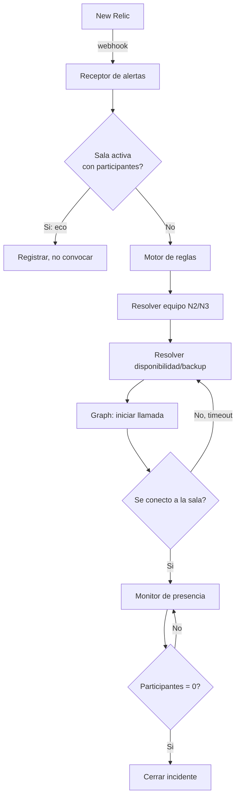

# Especificación — Sistema de Convocatoria Automática N2/N3 por Alertas

Sep 24, 2026 · @Carlos Sanchez

## Resumen ejecutivo

Este es un **sistema tradicional orientado a eventos** (webhook + motor de orquestación + integraciones), **no un agente de IA**. La lógica de enrutamiento (severidad→equipo, disponibilidad→backup, reintento→escalamiento) es determinística y debe ser auditable durante un incidente productivo; un LLM añadiría latencia y una fuente de fallas no predecible sin aportar valor en este caso.

- **Objetivo**: ante una alerta de New Relic en cualquiera de los 20 sistemas productivos, convocar automáticamente — en minutos, sin intervención manual — al equipo N2 o N3 correspondiente a una sala de Teams de acción, reintentando hasta lograr conexión efectiva.
- **Componentes**: receptor de webhook, motor de reglas/estado, integración con Microsoft Graph (Calling API + gestión de sala), tablas de configuración de equipos, disponibilidad y severidad.
- **Riesgo crítico de viabilidad**: el efecto de "timbre constante en el dispositivo móvil" depende de registrar un bot de llamadas en Microsoft Graph con permiso de aplicación `Calls.Initiate.All` y de consentimiento de administrador del tenant — ver la sección de riesgo técnico antes de comprometer cronograma.
- Se deja la puerta abierta a una v2 con integración al flujo de talento humano para automatizar disponibilidad/vacaciones, según lo indicado.

## Supuestos declarados

- **Disponibilidad y backups**: tabla de configuración manual (persona ↔ backup ↔ vigencia), sin integración a talento humano en v1.
- **"Llamar"** = iniciar una llamada real vía Microsoft Graph Calling API (bot registrado) que suena en el dispositivo móvil del usuario, no solo notificación push o chat.
- **"Conectado"** = el usuario se unió efectivamente a la sala de Teams (no basta con contestar la llamada).
- **"Sala inactiva"** = cero participantes en la sala; no requiere un cierre explícito de incidente por un humano.
- **Origen de alertas**: un único webhook de New Relic (no pasa por Opsgenie u otro ITSM intermedio).
- **Tenant**: ya existe el tenant de Microsoft 365/Azure; se asume que se puede registrar una app/bot con permisos de administrador (pendiente de confirmar, ver preguntas abiertas).
- **Volumen**: 20 sistemas productivos con alertas diarias, incluyendo alertas eco/secundarias que deben suprimirse si ya hay participantes conectados en la sala del incidente correspondiente.
- **Severidad**: viene en el payload del webhook de New Relic (ej. campo `priority`) y mapea a N2 o N3 mediante tabla de configuración.

## Flujo funcional principal

1. New Relic dispara una alerta y hace POST al webhook, con sistema afectado, severidad e identificador de incidente/condición.
2. El motor de reglas determina el equipo (N2 o N3) según la tabla severidad→equipo, y la sala según la tabla sistema→equipo.
3. Se verifica si ya existe una sala activa para esa combinación sistema+incidente con ≥1 participante conectado. Si es así, la alerta se trata como eco: se registra pero no dispara nueva convocatoria.
4. Si no hay sala activa con participantes, se crea o reutiliza la sala predeterminada del equipo y se inicia el ciclo de convocatoria.
5. Para cada miembro relevante, en orden de prioridad de guardia:
   1. Se consulta la tabla de disponibilidad; si está en vacaciones o no disponible, se sustituye por su backup.
   2. Se inicia una llamada Graph al usuario (o backup); el teléfono timbra.
   3. Si no contesta o no se une en el tiempo definido, se reintenta o se escala al siguiente en la lista, según la política de reintentos.
6. El ciclo continúa hasta que todos los miembros relevantes estén conectados o se agote la lista de guardia + backups.
7. Un monitor de presencia vigila la sala; al llegar a 0 participantes, se marca inactiva y el incidente se cierra en el sistema.

## Reglas de negocio

**Severidad → equipo** (valores ilustrativos, deben confirmarse en la tabla real)

| Severidad New Relic | Equipo convocado |
| --- | --- |
| Critical | N3 (+ notificación a N2) |
| High | N2, escala a N3 si no hay respuesta en X min |
| Warning | N2, según configuración |

**Backup por disponibilidad**

- Si el titular figura "no disponible" en la ventana de tiempo de la alerta, se llama directamente a su backup designado, sin intentar primero al titular.
- Si el backup también está no disponible, se pasa al siguiente en la lista de guardia del equipo (falla en cascada).

**Reintento de llamada**

- **Definido**: reintento **en paralelo** (se llama a todos los miembros elegibles del equipo simultáneamente, no en secuencia), con **5 intentos de llamada** por miembro. Si el miembro no contesta o no se une tras los 5 intentos, se salta a su backup.
- El ciclo se detiene cuando (a) todos los miembros relevantes están conectados, o (b) se agota la lista completa de guardia + backups sin respuesta — este segundo caso requiere definir un escalamiento humano manual (ej. notificación a un líder de equipo). Pendiente de definir en una iteración posterior.

**Deduplicación de alertas eco/secundarias**

- Clave de deduplicación: sistema + identificador de incidente/condición (o sistema + ventana de tiempo activa si New Relic no provee un id estable).
- Si la sala asociada a esa clave ya tiene ≥1 participante conectado, la alerta se registra en auditoría pero no dispara nueva convocatoria ni nuevas llamadas.
- Si la sala existe pero está vacía (0 participantes, aún no cerrada por el monitor), se trata como nueva convocatoria y reabre el ciclo.

**Cierre de sala**

- Un job/listener de presencia en Teams monitorea el conteo de participantes de cada sala activa.
- Al llegar a 0 participantes, la sala se marca inactiva, el incidente se cierra en el sistema, y la sala queda disponible para una futura convocatoria.

## Modelo de datos y configuración

**Tabla `equipos_guardia`**

| Campo | Descripción |
| --- | --- |
| equipo\_id | N2 / N3 |
| sistema\_id | Sistema productivo cubierto |
| miembro\_id | Usuario Teams/Entra ID del miembro |
| orden\_prioridad | Orden de llamada dentro del equipo |
| sala\_teams\_id | Sala predeterminada de Teams para ese equipo/sistema |

**Tabla `disponibilidad`**

| Campo | Descripción |
| --- | --- |
| miembro\_id | Usuario |
| estado | disponible / vacaciones / no disponible |
| backup\_id | Usuario que lo reemplaza |
| vigente\_desde | Inicio del estado |
| vigente\_hasta | Fin del estado |

**Tabla `severidad_equipo`**

| Campo | Descripción |
| --- | --- |
| severidad\_new\_relic | Valor tal como llega en el payload (ej. critical, high, warning) |
| equipo\_convocado | N2 / N3 |
| escalamiento\_automatico | Si escala a otro equipo tras X minutos sin respuesta |

**Registro de incidentes** (dato de runtime, no configuración)

incidente\_id, sistema\_id, severidad, sala\_teams\_id, estado (abierto/cerrado), timestamp\_apertura, timestamp\_cierre, historial de participantes conectados, decisiones de reintento tomadas.

## Arquitectura técnica

**Componentes**

1. **Receptor de webhook** (endpoint HTTPS público, autenticado) — recibe el payload de New Relic.
2. **Motor de reglas/orquestación** — resuelve severidad→equipo, sistema→sala, consulta disponibilidad, decide reintentos y escalamiento. Mantiene el estado del incidente (máquina de estados: nuevo → convocando → conectado → inactivo/cerrado).
3. **Adaptador Microsoft Graph** — crea o reutiliza la sala de Teams, inicia llamadas salientes vía Calling API, consulta el conteo de participantes.
4. **Cola de reintentos / temporizador** — gestiona reintentos y timeouts sin bloquear el flujo principal.
5. **Configuración** — las tres tablas de la sección anterior (idealmente editable sin despliegue: base de datos simple o panel admin básico).
6. **Auditoría/logging** — registro de cada alerta recibida, decisión tomada y resultado; crítico para trazabilidad en un incidente productivo.

**Integraciones**

- **New Relic → sistema**: webhook saliente configurado por condición de alerta, con payload JSON que incluye sistema y severidad.
- **Sistema → Microsoft Teams**: Microsoft Graph Communications API para iniciar la llamada y gestionar la sala/reunión (detalle de permisos en la siguiente sección).

## Riesgo técnico crítico: viabilidad de las llamadas automáticas

Este es el punto de mayor riesgo de todo el diseño. Lograr el efecto de "timbre constante en el dispositivo móvil" mediante una llamada automática requiere registrar un bot de llamadas en Microsoft Graph con el permiso de aplicación `Calls.Initiate.All`, necesario para que el bot inicie una llamada punto a punto hacia un usuario específico de Teams ([Microsoft Learn — Create call, consultado 2026-09-24](https://learn.microsoft.com/en-us/graph/api/application-post-calls?view=graph-rest-1.0)).

- Requiere **consentimiento de administrador del tenant** para permisos de aplicación (no delegados), lo cual puede tomar tiempo de gestión interna antes de poder empezar a construir.
- El comportamiento exacto de una llamada bot→usuario Teams (frente a bot→PSTN) debe validarse con un piloto técnico antes de comprometer cronograma; la documentación de Microsoft es densa y el comportamiento varía según el tipo de destino.
- **Alternativa de menor riesgo** (si el piloto falla o toma más tiempo del esperado): notificación push de alta prioridad como primer intento, con llamada real solo como escalamiento tras N segundos sin respuesta. Reduce la dependencia de la Calling API en el camino feliz, aunque no cumple el requisito tal como se planteó originalmente.
- **Recomendación**: validar esta pieza primero, como spike técnico aislado (registrar el bot, obtener consentimiento, hacer una llamada de prueba end-to-end), antes de construir el resto del sistema. Es el componente con mayor probabilidad de bloquear o retrasar el proyecto.

## Criterios de aceptación del MVP

- Una alerta crítica/alta de cualquiera de los 20 sistemas configurados dispara, en menos del SLA definido (ej. 60 segundos) desde la recepción del webhook, el inicio de llamadas al equipo N2 o N3 según la tabla de severidad.
- Si un miembro titular figura como no disponible en la tabla de configuración, se llama a su backup sin intervención manual.
- Las llamadas se reintentan según la política definida hasta que el miembro se une a la sala o se agota la lista de guardia + backups.
- Una segunda alerta del mismo sistema mientras ya hay participantes conectados en su sala no genera nuevas llamadas (se registra como eco).
- Cuando la sala llega a 0 participantes, el sistema la marca inactiva y queda lista para una futura convocatoria.
- Toda decisión (a quién se llamó, por qué, resultado) queda registrada y es consultable para análisis posterior al incidente.

## Fuera de alcance (v1)

- Integración automática con el sistema de talento humano para disponibilidad/vacaciones (v2, mencionada como dirección futura).
- Escalamiento a niveles fuera de N2/N3 (ej. gerencia, proveedores externos).
- Integración con más de un canal de alertas (solo New Relic vía webhook en v1).
- Dashboard de métricas (MTTR, efectividad de convocatoria) — recomendado para v2, dado que el log de auditoría sí queda disponible desde v1.
- Definición del escalamiento humano manual cuando se agota toda la lista de guardia + backups sin respuesta — queda pendiente para una iteración posterior (ver Reglas de negocio).

## Decisiones confirmadas

1. **Registro de app en Entra/Graph**: se solicitará formalmente; ver instrucciones detalladas de configuración más abajo.
2. **Reintento**: en paralelo (ver Reglas de negocio).
3. **Intentos antes de escalar a backup**: 5 por miembro.
4. **Payload del webhook**: tag de sistema, severidad y monitor; deduplicación por sistema + ventana de tiempo. Ver especificación detallada de la integración con New Relic más abajo.
5. **Sala de Teams**: fija y persistente por equipo (no se crea una nueva por incidente).
6. **Panel de administración**: sí entra en el alcance del MVP para editar las tablas de configuración (equipos, disponibilidad, severidad).

## Registro de la app en Microsoft Entra/Graph

**Paso 1 — Registrar la aplicación**

1. En el portal de Azure (Entra ID > App registrations), crear un nuevo registro, tipo "single tenant".
2. Anotar `Application (client) ID` y `Directory (tenant) ID`.
3. Generar un client secret (Certificates & secrets) o, preferible por seguridad, un certificado; guardarlo en AWS Secrets Manager, nunca en variables de entorno planas ni en el repositorio.

**Paso 2 — Solicitar permisos de aplicación**

1. En API permissions, agregar Microsoft Graph > Application permissions > `Calls.Initiate.All` (necesario para que el bot inicie una llamada punto a punto hacia un usuario específico).
2. Agregar también `Calls.AccessMedia.All` si se requiere acceso a medios en tiempo real, y `OnlineMeetings.ReadWrite.All` si la sala se gestiona como reunión de Teams.
3. Solicitar **consentimiento de administrador del tenant** (Grant admin consent) — este paso requiere un administrador global o de aplicaciones; no lo puede autoconceder el equipo de desarrollo.

**Paso 3 — Registrar el bot de llamadas**

1. Registrar la app como bot en el portal de desarrolladores de Teams, habilitando `supportsCalling` en el manifiesto.
2. Configurar el endpoint público HTTPS que Graph usará para notificaciones de estado de la llamada (callback URL).
3. Validar licenciamiento: si se requiere que el bot origine llamadas PSTN (no solo VoIP interno Teams), se necesita un Calling Plan o Direct Routing configurado en el tenant — confirmar con el equipo de M365 si aplica al caso de uso (llamada a usuarios internos de Teams, no a números externos).

**Paso 4 — Piloto técnico**

1. Antes de construir el motor de orquestación completo, validar end-to-end: registrar el bot, obtener el consentimiento, hacer una llamada de prueba `POST /communications/calls` hacia un usuario interno de prueba y confirmar que efectivamente timbra en su dispositivo móvil.
2. Documentar tiempos de aprobación reales del consentimiento de administrador (puede tomar días dependiendo de gobierno interno de TI).

**Responsable sugerido**: administrador de M365/Azure del tenant, en conjunto con el equipo de desarrollo. Este trámite debe iniciarse en paralelo al desarrollo, no después — es la ruta crítica del proyecto.

## Especificación de la integración con New Relic

**Mecanismo**: New Relic envía las alertas mediante un Workflow de Applied Intelligence con un canal de tipo Webhook, con plantilla de payload personalizable (sintaxis Handlebars) y headers HTTP configurables.

**Campos requeridos en el payload** (a definir como plantilla custom en el workflow de New Relic, no el payload por defecto):

| Campo | Origen en New Relic | Uso en el sistema |
| --- | --- | --- |
| `system_tag` | Tag del monitor/entidad afectada | Resuelve `sistema_id` en la tabla `equipos_guardia` |
| `severity` | Prioridad de la condición de alerta (critical / high / warning) | Resuelve equipo (N2/N3) vía tabla `severidad_equipo` |
| `monitor_name` / `condition_name` | Nombre de la condición o monitor que disparó la alerta | Texto descriptivo en la sala de Teams y en el log de auditoría |
| `current_state` | Estado del incidente (open / closed / acknowledged) | Distingue alerta nueva de alerta de recuperación; solo `open` dispara convocatoria |
| `timestamp` | Momento del evento | Define la ventana de tiempo usada en la deduplicación |

**Deduplicación** (confirmado): clave = `system_tag` + ventana de tiempo activa. Mientras exista una sala abierta para ese sistema dentro de la ventana vigente, cualquier alerta adicional del mismo sistema se trata como eco (se registra, no convoca). La ventana se cierra cuando el monitor de presencia detecta 0 participantes en la sala (ver Reglas de negocio).

**Autenticación del webhook**: New Relic permite incluir headers HTTP personalizados en la configuración del canal. Se recomienda un header con un secreto compartido (ej. `X-Webhook-Secret`) validado en el receptor antes de procesar el payload, para evitar que el endpoint público acepte solicitudes falsificadas.

**Pendiente de definición operativa**: qué tags deben existir en cada uno de los 20 sistemas productivos en New Relic para que `system_tag` sea consistente con `sistema_id` en la tabla de configuración — requiere coordinación con el equipo que administra los monitores.

## Panel de administración

Entra en el alcance del MVP (decisión confirmada). Permite editar sin despliegue las tres tablas de configuración (`equipos_guardia`, `disponibilidad`, `severidad_equipo`) descritas en Modelo de datos.

**Alcance funcional mínimo**

- CRUD sobre las tres tablas de configuración.
- Marcar a un miembro como no disponible (vacaciones) y asignar su backup, con rango de fechas.
- Consultar el historial de incidentes (registro de auditoría): quién fue convocado, cuándo, resultado.

**Acceso**: autenticación con el mismo tenant de Microsoft Entra ID (SSO corporativo), sin credenciales propias del panel — evita gestionar una base de usuarios adicional y aprovecha los grupos de seguridad existentes para restringir quién puede editar la configuración de guardia.

**Fuera del MVP dentro del panel**: reportes/dashboards de métricas (MTTR, efectividad) — ya se definió como fuera de alcance de v1 en general.

## Principios de arquitectura, ingeniería y seguridad

El volumen esperado (20 sistemas, alertas diarias, picos esporádicos en incidentes) es bajo y no sostenido. La arquitectura debe optimizar por **costo-eficiencia y simplicidad**, no por escala — sobre-construir aquí (microservicios, clusters, colas dedicadas) es tan mal diseño como sub-construir.

**Arquitectura (AWS, serverless-first)**

- API Gateway + Lambda como receptor del webhook: pago por invocación, sin infraestructura ociosa entre alertas.
- Step Functions como motor de orquestación del ciclo de convocatoria (llamadas paralelas, reintentos, timeouts, escalamiento a backup) — es una máquina de estados por naturaleza; Step Functions la modela nativamente, con reintentos y esperas sin necesidad de infraestructura propia de colas/temporizadores.
- DynamoDB para las tablas de configuración y el registro de incidentes: sin servidor que mantener, costo marginal a este volumen.
- Secrets Manager para credenciales de Graph (client secret/certificado) y el secreto compartido del webhook — nunca en variables de entorno en texto plano ni en el repositorio.
- CloudWatch Logs + Alarms para observabilidad y para detectar fallas del propio sistema de guardia (ej. si el motor de orquestación falla, alguien debe enterarse).
- Panel de administración: aplicación web simple (ej. contenedor liviano en Fargate o sitio estático + API Gateway/Lambda) autenticada contra Entra ID; evitar introducir un stack nuevo solo para el panel.

**Principios de ingeniería**

- Infraestructura como código (Terraform o AWS CDK) desde el inicio — este sistema es crítico y debe ser reproducible y auditable.
- Procesamiento idempotente del webhook: la clave de deduplicación (sistema + ventana de tiempo) debe prevenir dobles convocatorias incluso si New Relic reintenta la entrega del webhook.
- Configuración como datos, no como código: cambiar un equipo, un backup o un mapeo de severidad nunca debe requerir un despliegue.
- Degradación controlada ante fallas de Graph API: si una llamada falla técnicamente (no por falta de respuesta del usuario, sino por error de la API), debe reintentarse con backoff y, si persiste, notificar por un canal alterno (ej. correo o Teams chat) en vez de fallar en silencio.

**Principios de seguridad**

- Menor privilegio en roles IAM: cada Lambda/función con permisos acotados exactamente a lo que necesita (ninguna función con acceso amplio a DynamoDB o Secrets Manager más allá de lo suyo).
- Endpoint del webhook validado con secreto compartido/firma, y protegido con throttling (API Gateway) para evitar abuso del endpoint público.
- Cifrado en reposo por defecto (KMS) para DynamoDB y Secrets Manager; cifrado en tránsito (HTTPS/TLS) en todos los saltos.
- Registro de auditoría inmutable: las decisiones de convocatoria (a quién se llamó, por qué, resultado) no deben ser editables después de escritas — relevante para postmortems de incidentes productivos.
- Datos de contacto de personas (teléfonos, disponibilidad) tratados con el mismo cuidado que cualquier dato personal: acceso restringido a quien administra el panel, sin exponerse en logs de aplicación.
